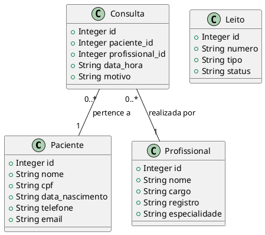
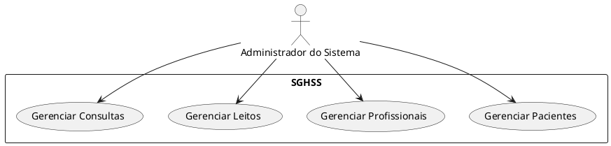
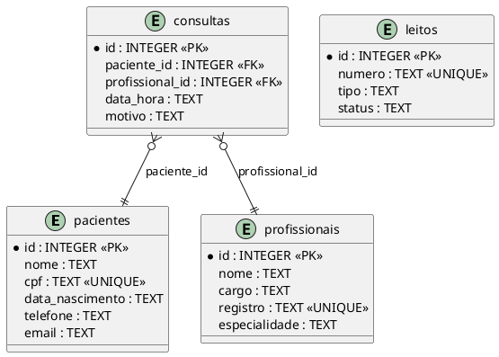

# 🏥 SGHSS - Sistema de Gestão Hospitalar e de Serviços de Saúde

[](https://www.python.org/)
[](https://www.sqlite.org/)
[](https://github.com/seu-usuario/sghss-sistema-gestao-hospitalar)
[](LICENSE)

## 📋 Índice

- [Sobre o Projeto](#sobre-o-projeto)
- [Funcionalidades](#funcionalidades)
- [Tecnologias Utilizadas](#tecnologias-utilizadas)
- [Pré-requisitos](#pré-requisitos)
- [Instalação](#instalação)
- [Como Usar](#como-usar)
- [Estrutura do Projeto](#estrutura-do-projeto)
- [Diagramas](#diagramas)
- [Testes](#testes)
- [Contribuição](#contribuição)
- [Licença](#licença)
- [Autor](#autor)

## 🏥 Sobre o Projeto

O **SGHSS (Sistema de Gestão Hospitalar e de Serviços de Saúde)** é um sistema de gestão desenvolvido em Python com interface de terminal, projetado para auxiliar na administração de recursos hospitalares. O sistema oferece uma solução completa para gerenciamento de pacientes, profissionais de saúde, leitos e consultas médicas.

### 🎯 Objetivos

- **Principal**: Desenvolver um sistema de gestão hospitalar funcional e intuitivo
- **Específicos**:
  - Gerenciar cadastro de pacientes com informações completas
  - Controlar profissionais de saúde e suas especialidades
  - Administrar leitos hospitalares e seus status
  - Agendar e gerenciar consultas médicas
  - Fornecer interface amigável com cores e ícones
  - Implementar validações de dados e tratamento de erros

## ✨ Funcionalidades

### ✅ Gerenciamento de Pacientes
- Cadastrar paciente com nome, CPF, data de nascimento, telefone e email
- Validar CPF único
- Editar informações do paciente
- Listar todos os pacientes
- Remover paciente do sistema

### ✅ Gerenciamento de Profissionais
- Cadastrar profissional com nome, cargo, registro e especialidade
- Validar registro único
- Editar informações do profissional
- Listar todos os profissionais
- Remover profissional do sistema

### ✅ Gerenciamento de Leitos
- Cadastrar leito com número, tipo e status
- Validar número único
- Editar informações do leito
- Listar todos os leitos
- Remover leito do sistema

### ✅ Gerenciamento de Consultas
- Agendar consulta com paciente, profissional, data/hora e motivo
- Validar relacionamentos entre paciente e profissional
- Editar informações da consulta
- Listar todas as consultas
- Remover consulta do sistema

### ✅ Interface de Usuário
- Menu principal com navegação clara
- Cores e ícones para melhor experiência
- Mensagens de feedback (sucesso, erro, aviso)
- Validação de entrada de dados

## 🛠️ Tecnologias Utilizadas

- **Linguagem**: Python 3.x
- **Banco de Dados**: SQLite3
- **Interface**: Terminal com cores ANSI
- **Sistema Operacional**: Windows/Linux/MacOS

## 📋 Pré-requisitos

Antes de começar, você precisa ter instalado:

- **Python 3.x** ou superior
- **Git** (para clonar o repositório)

### Verificando a instalação do Python

```bash
python --version
# ou
python3 --version
```

## 🚀 Instalação

1. **Clone o repositório**
```bash
git clone https://github.com/seu-usuario/sghss-sistema-gestao-hospitalar.git
cd sghss-sistema-gestao-hospitalar
```

2. **Execute o sistema**
```bash
python sghss_terminal.py
```

3. **Opcional: Adicionar dados de exemplo**
```bash
python adicionar_dados.py
```

## 📖 Como Usar

### 1. Iniciando o Sistema

Execute o comando principal:
```bash
python sghss_terminal.py
```

### 2. Menu Principal

O sistema exibirá um menu colorido com as seguintes opções:

```
======================================================================
🏥 SGHSS - Sistema de Gestão Hospitalar e de Serviços de Saúde 🏥
======================================================================

╭─────────────────────────────────────╮
│ Menu Principal                      │
╰─────────────────────────────────────╯

  1 👤 Gerenciar Pacientes
  2 👨‍⚕️ Gerenciar Profissionais
  3 🛏️ Gerenciar Leitos
  4 📅 Gerenciar Consultas
  0 🚪 Sair do Sistema

──────────────────────────────────────────────────
Escolha uma opção:
```

### 3. Navegação

- Use os números (1-4) para selecionar as opções
- Use 0 para sair do sistema
- Siga as instruções na tela para cada operação

### 4. Exemplos de Uso

#### Cadastrando um Paciente
```
1. Selecione "1" no menu principal
2. Selecione "1" para adicionar paciente
3. Preencha os dados solicitados:
   - Nome: João Silva
   - CPF: 12345678901
   - Data de nascimento: 1990-01-01
   - Telefone: 11999999999
   - Email: joao@email.com
4. Confirme os dados
```

#### Agendando uma Consulta
```
1. Selecione "4" no menu principal
2. Selecione "1" para agendar consulta
3. Informe o ID do paciente
4. Informe o ID do profissional
5. Digite a data/hora (formato: YYYY-MM-DD HH:MM:SS)
6. Informe o motivo da consulta
```

## 📁 Estrutura do Projeto

```
VidaPlus_Willian II/
├── sghss_terminal.py          # Sistema principal
├── adicionar_dados.py         # Script para dados de exemplo
├── sghss_terminal.db          # Banco de dados SQLite
├── DOCUMENTACAO_SGHSS.md      # Documentação completa
└── README.md                  # Este arquivo
```

### Descrição dos Arquivos

- **`sghss_terminal.py`**: Sistema principal com todas as funcionalidades
- **`adicionar_dados.py`**: Script para popular o banco com dados de exemplo
- **`sghss_terminal.db`**: Banco de dados SQLite com as tabelas e dados
- **`DOCUMENTACAO_SGHSS.md`**: Documentação técnica completa do projeto

## 📊 Diagramas

### Diagrama de Classes


### Diagrama de Caso de Uso


### Diagrama Entidade-Relacionamento (DER)


## 🧪 Testes

O sistema foi testado com sucesso nas seguintes operações:

### ✅ Testes Realizados

1. **Cadastro de Paciente** - ✅ PASSOU
2. **Validação de CPF Duplicado** - ✅ PASSOU
3. **Cadastro de Profissional** - ✅ PASSOU
4. **Cadastro de Leito** - ✅ PASSOU
5. **Agendamento de Consulta** - ✅ PASSOU
6. **Listagem de Dados** - ✅ PASSOU
7. **Edição de Dados** - ✅ PASSOU
8. **Remoção de Dados** - ✅ PASSOU

### 🧪 Como Executar os Testes

Para testar o sistema manualmente:

1. Execute o sistema: `python sghss_terminal.py`
2. Teste cada funcionalidade seguindo os exemplos acima
3. Verifique se as validações funcionam corretamente
4. Confirme se os dados são salvos no banco

## 🤝 Contribuição

Contribuições são sempre bem-vindas! Para contribuir:

1. Faça um fork do projeto
2. Crie uma branch para sua feature (`git checkout -b feature/AmazingFeature`)
3. Commit suas mudanças (`git commit -m 'Add some AmazingFeature'`)
4. Push para a branch (`git push origin feature/AmazingFeature`)
5. Abra um Pull Request

### 📝 Padrões de Contribuição

- Use nomes descritivos para commits
- Documente novas funcionalidades
- Mantenha a compatibilidade com Python 3.x
- Teste suas alterações antes de submeter

## 📄 Licença

Este projeto está sob a licença MIT. Veja o arquivo [LICENSE](LICENSE) para mais detalhes.

---

## 🎯 Status do Projeto

- ✅ **Concluído**: Todas as funcionalidades implementadas
- ✅ **Testado**: Sistema testado e funcionando
- ✅ **Documentado**: Documentação completa disponível
- 🔄 **Em Manutenção**: Melhorias contínuas

---

<div align="center">

**⭐ Se este projeto foi útil para você, considere dar uma estrela! ⭐**

</div> 